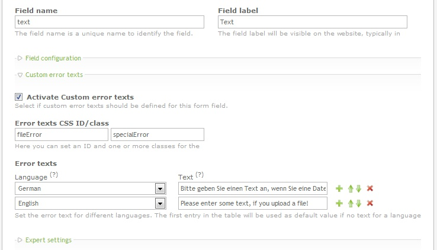

[](https://packagist.org/packages/cliffparnitzky/form-custom-error-text)
[](https://packagist.org/packages/cliffparnitzky/form-custom-error-text)
[](https://packagist.org/packages/cliffparnitzky/form-custom-error-text)

Contao Extension: FormCustomErrorText
=====================================

Offers the possibility to define custom error texts for each form field.


Installation
------------

Install the extension via composer: [cliffparnitzky/form-custom-error-text](https://packagist.org/packages/cliffparnitzky/form-custom-error-text).

If you prefer to install it manually, download the latest release here: https://github.com/cliffparnitzky/FormCustomErrorText/releases


Tracker
-------

https://github.com/cliffparnitzky/FormCustomErrorText/issues


Compatibility
-------------

- Contao version >= 3.2.0 ... <  3.6.0
- Contao version >= 4.4.0


Dependency
----------

This extension is dependent on the following extensions:

- [[menatwork/contao-multicolumnwizard]](https://packagist.org/packages/menatwork/contao-multicolumnwizard)


Screenshot
----------




Additional information
----------------------

### Insert tags

The following inserttags could be used:

````
{{field::*}} ... This tag returns all values of the current field (replace * with any attribute of the field, for example 'label' or 'maxlength').
````